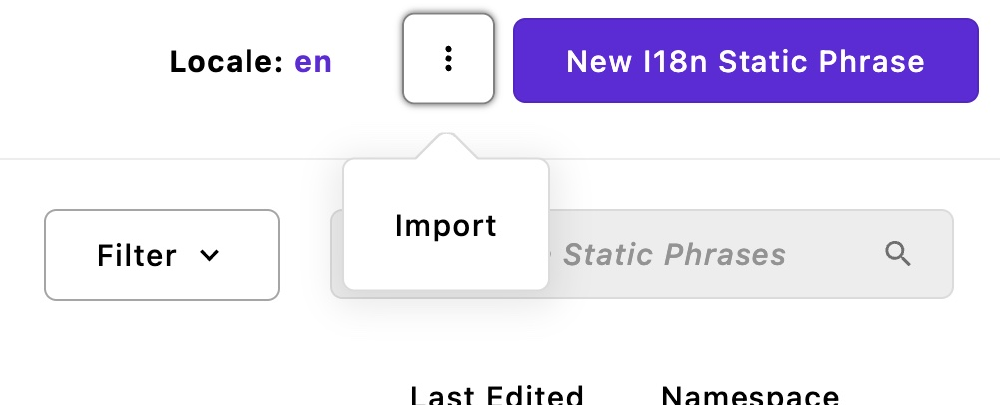
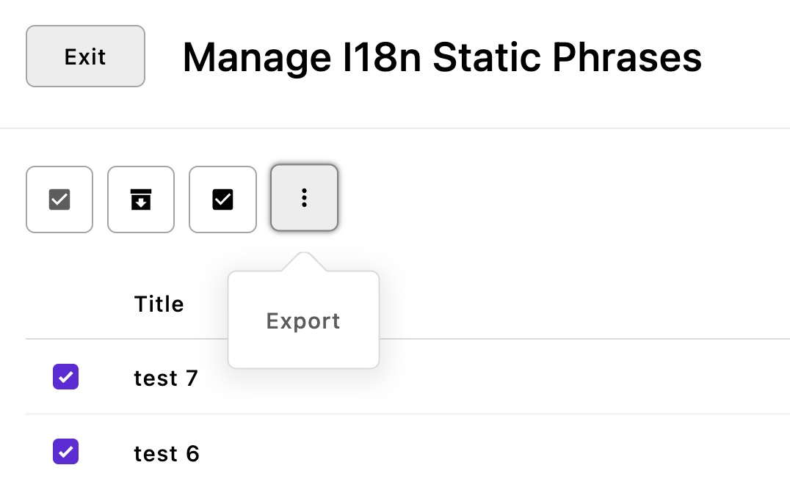

<a id="contents"></a>

# i18n-static
Translation editable A3 pieces with i18next

1. [Installation](#1)<br>
2. [Configuration](#2)<br>
3. [Import and export](#3)<br>

This module adds editable pieces for translation through i18next to an A3 project.

> This module is intended to localize static text in templates i.e text wrapped with `__("...")`, **not localize editable content.** If your goal is content localization, you should use the [default localization feature in A3](https://v3.docs.apostrophecms.org/guide/localization/) instead.

---

Pieces are edited in the module `@apostrophecms/i18n-static`. Then, JSON files are generated for the i18n module used in Apostrophe.

This will add an entry in the admin bar "I18n Static Phrases".

Only admin users have access to this module for now.

<a id="1"></a>

## 1 Installation [&#x2B06;](#contents)

Install the module with `npm i @apostrophecms/i18n-static` then declare it in the modules configuration in `app.js`:

```js
  modules: {
    '@apostrophecms/i18n-static': {},
  }
```

<a id="2"></a>


## 2 Configuration [&#x2B06;](#contents)

The locales configuration comes from the i18n module in a A3 project. Usually, in `modules/@apostrophecms/i18n/index.js`. Example:

```js
module.exports = {
  options: {
    defaultLocale: 'en',
    locales: {
      en: { label: 'English' },
      fr: {
        label: 'French',
        prefix: '/fr'
      },
      sk: {
        label: 'Slovak',
        prefix: '/sk'
      },
      es: {
        label: 'Spanish',
        prefix: '/es'
      },
      'pt-BR': {
        label: 'Portuguese',
        prefix: '/pt'
      },
      ar: {
        label: 'Arabic',
        prefix: '/ar'
      }
    }
  }
};
```

The option `directory` can be used to change the JSON output folder. By default, it is `modules/@apostrophecms/i18n/i18n`.

```js
  modules: {
    '@apostrophecms/i18n-static': {
      options: {
        directory: 'another/path/folder'
      }
    },
  }
```

I18n-static pieces have a `namespace` field. Namespaces are found in the A3 project. But if one is unnecessary, it can be removed from the i18n-static `namespace` field by configuring the array `excludeNamespaces` in the module's options.

```js
  modules: {
    '@apostrophecms/i18n-static': {
      options: {
        excludeNamespaces: [ 'aposEvent', 'aposForm' ]
      }
    },
  }
```

<a id="3"></a>

## 3 Import and export [&#x2B06;](#contents)

The import feature is available in the manager modal: 

As the [piece-type-importer plugin](https://github.com/apostrophecms/piece-type-importer) is used, the CSV file used for import must include column names that match exactly the field names (optional empty column names can be excluded).

Example of a CSV:

```
title,namespace,valueSingular,valuePlural,valueZero
test 1,default,test singular,test plural,test zero
test 2,apostrophe,test,,
```

When imported, new pieces will be in draft. Use the publish batch feature to publish them.

The export feature is available in the context menu when items are selected for import. 

[The piece-type-exporter plugin](https://github.com/apostrophecms/piece-type-exporter) is used, so it will generate a CSV file following the same type of structure used for the importer plugin.